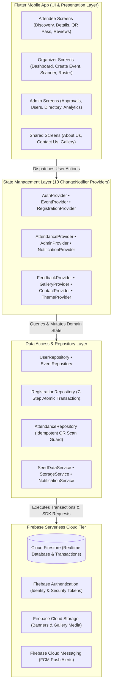
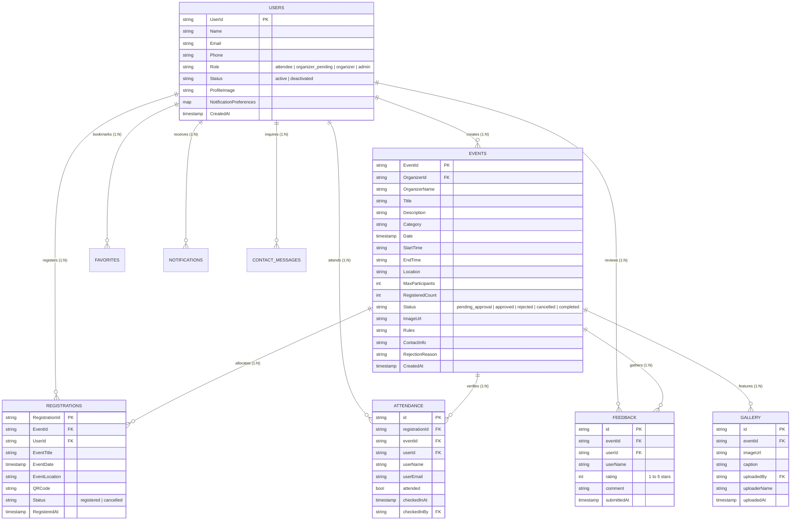
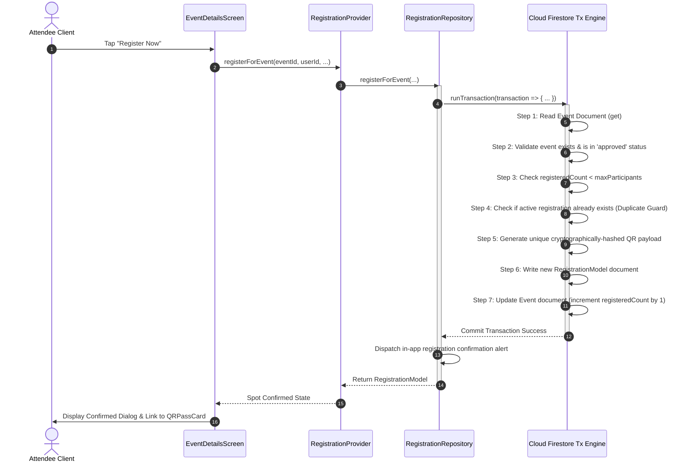
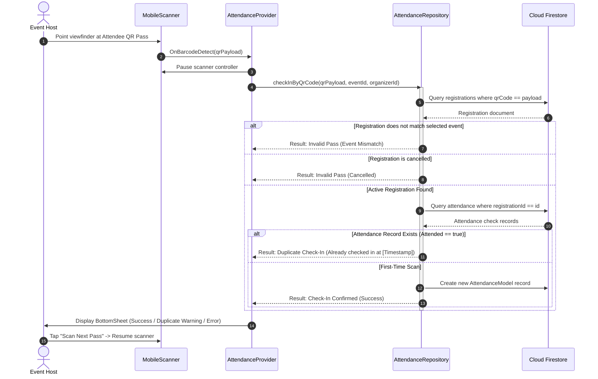

# EventEase — System Architecture & Technical Specification

```
  ______               _   ______                 
 |  ____|             | | |  ____|                
 | |____   _____ _ __ | |_| |__   __ _ ___  ___   
 |  __\ \ / / _ \ '_ \| __|  __| / _` / __|/ _ \  
 | |___\ V /  __/ | | | |_| |___| (_| \__ \  __/  
 |______\_/ \___|_| |_|\__|______\__,_|___/\___|  
==================================================
Multi-Tier Campus & Community Event Platform
```

**Document Version**: 1.0.0  
**Architectural Standard**: Clean 4-Layer Architecture (UI -> Presentation -> Repository -> Backend)  
**Target Platforms**: Flutter Multi-Platform (Android, iOS, Web)  
**Backend Infrastructure**: Firebase Serverless Ecosystem (Auth, Firestore, Cloud Storage, FCM)  

---

## 1. Architectural Principles & System Overview

EventEase is architected as an institutional-grade, multi-tier event discovery, registration, and attendance verification ecosystem. The core design principles governing this architecture include:

1. **Strict Layer Decoupling**: Separation between UI rendering, reactive state management, repository data access, and Firebase service APIs. No UI widget makes direct Firestore SDK calls.
2. **ACID Transactional Integrity**: Critical business operations (such as seat reservation and capacity decrement) execute within atomic Firestore transactions (`runTransaction`), preventing race conditions and capacity over-allocation.
3. **Cryptographic Anti-Tamper Verification**: Attendance verification relies on deterministic, signed QR payloads containing UUID tokens, verified against live registration records with single-scan idempotency.
4. **Institutional Role Isolation**: Strict Role-Based Access Control (RBAC) enforced simultaneously at the routing layer (`GoRouter` redirect guards) and at the database layer (`firestore.rules` and `storage.rules`).
5. **Accessibility & Design Excellence**: Grounded in the custom Signal Lime (`#C6F135`) design system adhering strictly to WCAG AA contrast compliance (4.5:1 text, 3:1 non-text elements).

---

## 2. High-Level Layered Architecture



---

## 3. Entity-Relationship & Domain Data Model



---

## 4. Role-Based Access Control (RBAC) Matrix

| Feature / Domain Module | Attendee | Organizer (Approved) | Organizer (Pending) | System Admin |
|---|:---:|:---:|:---:|:---:|
| **Discover & Search Events** | ✅ Full | ✅ Full | ✅ Full | ✅ Full |
| **Atomic Seat Registration** | ✅ Allowed | ✅ Allowed | ✅ Allowed | ✅ Allowed |
| **Generate Live Ticket Pass** | ✅ Allowed | ✅ Allowed | ✅ Allowed | ✅ Allowed |
| **Bookmark & Favorite Events**| ✅ Allowed | ✅ Allowed | ✅ Allowed | ✅ Allowed |
| **Submit Post-Event Review**  | ✅ (1 / event) | ✅ (1 / event) | ✅ (1 / event) | ✅ Moderation |
| **Create & Edit Events**      | ❌ Denied | ✅ (Enters Pending) | ❌ Restricted | ✅ Direct Publish |
| **Scan QR Code Attendance**   | ❌ Denied | ✅ (Own events) | ❌ Restricted | ✅ All events |
| **View Participant Rosters**  | ❌ Denied | ✅ (Own events) | ❌ Restricted | ✅ All events |
| **Broadcast Announcements**   | ❌ Denied | ✅ (Own events) | ❌ Restricted | ✅ All events |
| **Upload Memory Photos**      | ❌ Denied | ✅ (Own events) | ❌ Restricted | ✅ Full Access |
| **Approve / Reject Events**   | ❌ Denied | ❌ Denied | ❌ Denied | ✅ Queue & Reasons |
| **Approve Organizer Accounts**| ❌ Denied | ❌ Denied | ❌ Denied | ✅ Full Access |
| **User Account Deactivation** | ❌ Denied | ❌ Denied | ❌ Denied | ✅ Full Access |
| **Media Deletion & Moderation**| ❌ Denied | ❌ (Own media only) | ❌ Restricted | ✅ Full Audit |
| **Executive Reports & KPIs**  | ❌ Denied | ❌ Denied | ❌ Denied | ✅ Full Analytics |

---

## 5. Sequence Flow: Atomic 7-Step Registration Transaction

To eliminate race conditions when high concurrency occurs as an event approaches capacity, registration executes within `RegistrationRepository.registerForEvent` using Firestore's atomic transaction primitives.



---

## 6. Sequence Flow: QR Scanner & Single-Scan Attendance Verification



---

## 7. Security Architecture & Policy Enforcement

### Firestore Security Boundary (`firestore.rules`)
- **Authentication Guard**: Unauthenticated requests are rejected outright for non-public collections.
- **Owner-Only Read/Write**: Attendees can only read and mutate their own registrations, profile details, and notifications.
- **Admin Privilege Escalation Guard**: Role fields cannot be updated by client requests; only users possessing verified administrative status can elevate roles or deactivate accounts.
- **Event Lifecycle Immutability**: Public users can only read events in `approved` or `completed` states. Pending, rejected, or draft events remain isolated to the creating organizer and system administrators.
- **Atomic Field Isolation**: Atomic updates from registration transactions are restricted strictly to the `registeredCount` key.

### Cloud Storage Security Boundary (`storage.rules`)
- **Bucket Namespacing**: Media files are strictly partitioned into `/profile_photos/{userId}`, `/events/{eventId}`, and `/gallery/{eventId}`.
- **Write Verification**: Write access to event media requires authenticated organizer or administrative credentials.

---

## 8. Design System Specification

### Color Token Taxonomy

```
Light Mode (Warm Neutral Canvas):
  Canvas Canvas:        #F7F5F0  (Warm Cream)
  Card Surface:         #FFFFFF  (Pure Card)
  Primary Action:       #C6F135  (Signal Lime)
  On-Primary Text:      #1A1D0D  (Deep Charcoal - Contrast 12.4:1)
  Organizer Accent:     #6A5CFF  (Organizer Indigo)
  Verified Green:       #22B573  (Verified Badge)
  Critical Error:       #E53935  (Destructive)

Dark Mode (Deep Obsidian Canvas):
  Canvas Background:    #0F1015  (Obsidian)
  Card Surface:         #171821  (Elevated Dark Surface)
  Primary Action:       #C6F135  (Signal Lime)
  On-Primary Text:      #101404  (Deep Obsidian - Contrast 14.1:1)
  Organizer Accent:     #8B7FFF  (Bright Indigo)
  Verified Green:       #2DD489  (Verified Badge)
```

### Signature QR Pass Geometry
- **Ticket Stub Notches**: Clipped with `TicketStubClipper` at `fraction: 0.58` with radius `14px`.
- **Perforated Divider**: Dashed border with `dashWidth: 6`, `dashSpace: 4`, and `color: AppColors.lightDivider`.
- **QR Scan Module**: Encased in an immutable `#FFFFFF` background to guarantee camera contrast in dark mode.
- **Check-In Stamp**: Rotated by `-12.5°` with dynamic entrance animation upon check-in event detection.

---

## 9. Verification & Quality Assurance Metrics

- **Static Analysis**: `flutter analyze` — **0 errors, 0 warnings, 0 lints**.
- **Unit & Widget Test Coverage**: `flutter test` — **21 / 21 test cases passing**.
- **Target OS Compatibility**: Android 7.0+ (API 24+), iOS 13.0+, Web (Chromium / Safari / Firefox).

---

## 10. Diagram & Visual Asset Catalog

### A. Standalone Mermaid Files (`docs/diagrams/`)
- [`figure1_high_level_architecture.mmd`](file:///c:/Users/akela/Downloads/EventEase/docs/diagrams/figure1_high_level_architecture.mmd): Decoupled 4-layer architecture matching SRS Figure 1.
- [`figure2_use_case_diagram.mmd`](file:///c:/Users/akela/Downloads/EventEase/docs/diagrams/figure2_use_case_diagram.mmd): Actor relationships for Attendee, Organizer, and Admin matching SRS Figure 2.
- [`figure3_application_sitemap.mmd`](file:///c:/Users/akela/Downloads/EventEase/docs/diagrams/figure3_application_sitemap.mmd): Navigation hierarchy and role routing matching SRS Figure 3.
- [`figure4_entity_relationship_diagram.mmd`](file:///c:/Users/akela/Downloads/EventEase/docs/diagrams/figure4_entity_relationship_diagram.mmd): Full database schema and relations matching SRS Figure 4.
- [`atomic_registration_flow.mmd`](file:///c:/Users/akela/Downloads/EventEase/docs/diagrams/atomic_registration_flow.mmd): 7-step atomic concurrency transaction flow.
- [`qr_attendance_verification_flow.mmd`](file:///c:/Users/akela/Downloads/EventEase/docs/diagrams/qr_attendance_verification_flow.mmd): Live camera QR scan, validation, and anti-duplicate check-in flow.
- [`event_lifecycle_state_machine.mmd`](file:///c:/Users/akela/Downloads/EventEase/docs/diagrams/event_lifecycle_state_machine.mmd): Complete state transitions for event approval, full capacity, and completion.

### B. Generated Visual & Icon Assets (`assets/`)
- `assets/icons/app_logo.jpg`: Signal Lime glowing ticket emblem app icon.
- `assets/images/splash_hero.jpg`: Luminous futuristic ticket pass branding graphic.
- `assets/images/banner_technology.jpg`: High-resolution technology conference banner.
- `assets/images/banner_music.jpg`: High-resolution live concert festival banner.
- `assets/images/banner_arts.jpg`: Contemporary art gallery exhibition showcase banner.
- `assets/images/banner_sports.jpg`: Dynamic marathon and championship sports banner.

